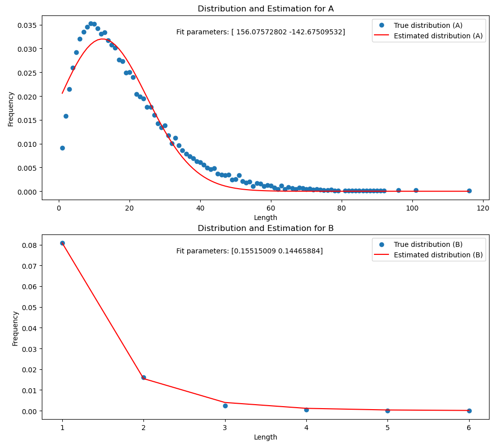

# Markov Chain SubPolymer Sampling

This Python script simulates the length of homogen (only one type of monomer) parts of a polymer using a Markov chain model. It generates a trajectory of monomer sequences and computes the length distribution of subsequences containing the same monomer.
The script also estimates the distribution of the subsequences using a (in this case gamma) distribution and plots the true and estimated distributions.

## Usage

- Set the simulation parameters such as the number of steps, states (monomers), and transition matrix in the script.
- Run the script to simulate the Markov chain and generate a polymer trajectory.
- The script computes the length distribution of homogen subsequences for each monomer.
- A gamma distribution is fitted to the true length distributions.
- The true and estimated length distributions are plotted using Matplotlib.

## Dependencies

- NumPy
- Matplotlib
- Scipy

## Example

To run the script with default parameters, simply execute:

```bash
python3 markov_chain_polymer_sampling.py
```

This will generate a polymer trajectory using the specified Markov chain model, compute the length distribution of homogen subsequences, fit a gamma distribution to the true length distribution, and plot the true and estimated distributions.

